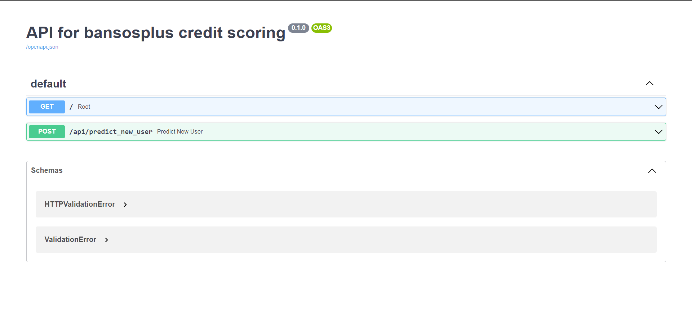

# BansosPlus Credit Scoring Model

Bansos Plus using credit scoring model to assess whether someone deserves to get the Bansos or not. 
We use machine learning algorithm to implement the credit scoring model and we also use a thousand
records of dataset to train our model. 

Our credit scoring model use a several variables, here is the list of the variables that we use:
1. Penghasilan (< 500, 500-1 juta, 1-1.5 juta, > 1.5 juta)
2. Luas Lantai (> 8m^2, < 8m^2)
3. Kualitas Dinding (Buruk, Biasa, Bagus)
4. Jumlah Makan dalam Sehari (0, 1, 2, 3)
5. Bahan Bakar (Kayu/Arang, Gas/LPG)
6. Pendidikan (SD, SMP, SMA, Sarjana)
7. Jumlah Aset (< 500, 500-1 juta, 1-1.5 juta, > 1.5 juta)
9. Kemampuan Berobat (Mampu, Tidak Mampu)

### Requirements

To run this API on your local computer, please install several requirements below:
1. Python 3.10.4
2. Docker 

### How to Build and Run?

Plase run several commands below to build and run the API on your local computer:

1. Build docker image

   ```
   docker build -t ml-api:latest .
   ```
2. Run the docker image on your computer

   ```
   docker run -d -p 8080:8080 ml-api:latest
   ```
3. Open the API on your browser 

   The API will run on your localhost port 8080.
   ```
   http://localhost:8080/docs
   ```

### Screenshots

Since we use FastAPI to serve our credit scoring model, it's automated to create API documentation using swagger.
You can directly test the API on the swagger documentation.



### Contributors

| ID          | Name                       |
| ----------- | -------------------------- |
| C002BSY3034 | Ghazian Tsabit Alkamil     |
| M002BSX0910 | Nadhira Aalia Syifaa       |
| M244BSY0176 | Abelito Faleyrio Visese    |
| M391BSY0311 | Sebastian Kurniawan W. W.  |